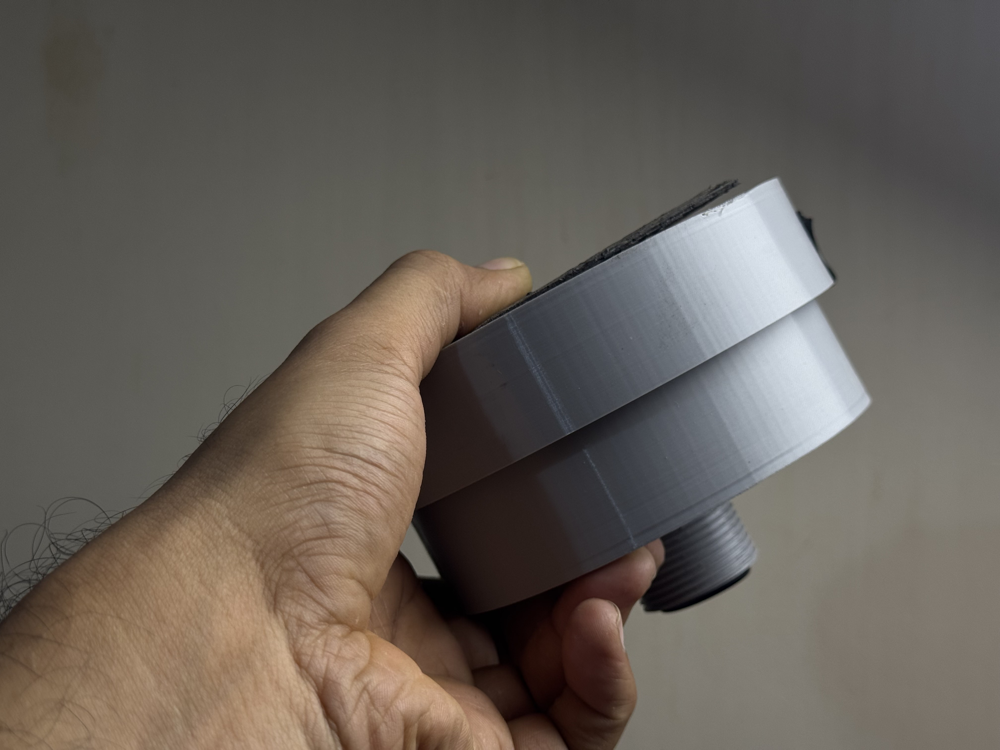

# TankSync — open-source smart water tank monitoring

[](LICENSE)
[](hardware/LICENSE)
[](https://docs.espressif.com/projects/esp-idf/)
[](https://github.com/Techposts/smartghar-homeassistant)

Long-range wireless water tank level monitoring using LoRa (RYLR998), ESP32, and a local-first architecture. Monitor multiple tanks from up to 5 km away. Works even when your internet doesn't.

<p align="center">
  
  
</p>
<p align="center">
  <sub><em>Custom circular TX PCB and current-production PETG enclosure (REV 2.2, May 2026) — tested through Delhi summer at 45°C ambient.</em></sub>
</p>

## Try the in-browser flasher first

👉 **[tanksync.smartghar.org/firmware/](https://tanksync.smartghar.org/firmware/)**

No `esptool`, no Python, no CLI. Plug your board into USB, click Install, the browser does the flashing through WebSerial. Works on Chrome/Edge desktop. Takes ~45 seconds per board.

## Why TankSync

- **Local-first.** Your hub keeps working when our cloud is down, when your ISP is down, when WiFi is down (LoRa runs without internet).
- **Long range.** Through-wall LoRa lets a single hub cover the whole property — terrace tanks, sump rooms, garden, borewell, all from one wall-mounted display.
- **Multi-tank.** Up to 10 transmitters per hub. Solar-powered TXes deep-sleep between readings (3-month battery on a single 18650).
- **Open at the core.** Firmware (AGPL-3.0) and hardware (CC BY-SA) are open. The HA integration is MIT. Fork it, modify it, deploy it.
- **Home Assistant native.** Auto-discovery via MQTT plus a dedicated [HACS integration](https://github.com/Techposts/smartghar-homeassistant) with real-time WebSocket push.
- **Cloud is optional.** Use the firmware locally with your own MQTT broker + your own dashboard. Or use [tanksync.smartghar.org](https://tanksync.smartghar.org) for hosted convenience.

## Architecture

```
                    LoRa 865/915 MHz (up to 5 km, through walls)
                    ==============================================>
  TRANSMITTER                                          HUB (RECEIVER)
  ESP32-C3 SuperMini                                   ESP32 DevKit
  + JSN-SR04T Ultrasonic                               + RYLR998 LoRa
  + RYLR998 LoRa                                       + SH1106 OLED
  + 18650 + solar                                      + WS2812 LED ring
                                                       + WiFi (optional)
                                                          |
                                              +-----------+-----------+
                                              |                       |
                                       MQTT (TLS)              Local web UI
                                              |              192.168.x.x
                                    +---------+---------+
                                    |                   |
                              Home Assistant      Cloud dashboard
                              (HACS integration)  (optional, hosted)
```

## Hardware

| Component | Part | Approx cost (INR) |
|-----------|------|-------------------|
| Receiver MCU | ESP32 DevKit v1 | ₹300–400 |
| Transmitter MCU | ESP32-C3 SuperMini | ₹200 |
| LoRa module | REYAX RYLR998 (×2) | ₹650 each |
| Ultrasonic sensor | JSN-SR04T (waterproof) | ₹350 |
| Display | SH1106 1.3" OLED I²C | ₹250 |
| Battery | Protected 18650 + holder | ₹200 |
| Solar charger | CN3791 MPPT module | ₹120 |
| Boost converter | MT3608 3.7 V → 5 V | ₹50 |

Total: **~₹3,800-5,200 per complete system** (one hub + one tank). Per-tank addition: ~₹1,500.

📐 **[Detailed wiring + power chains →](hardware/wiring.md)**
📋 **[Full BOM →](hardware/BOM.csv)**

## Quick start

### Option 1: Browser flasher (easiest — no install)

👉 **[tanksync.smartghar.org/firmware/](https://tanksync.smartghar.org/firmware/)**

Plug your board into a USB port, pick the right card (Receiver Hub or Transmitter), click Install. Done in ~45 sec.

### Option 2: esptool.py (CLI)

Download the latest `.bin` from [Releases](../../releases).

```bash
# Receiver (ESP32 DevKit)
esptool.py --chip esp32 -b 460800 write_flash 0x10000 tanksync-receiver-rx-vX.Y.Z.bin

# Transmitter (ESP32-C3 SuperMini)
esptool.py --chip esp32c3 -b 460800 write_flash 0x10000 tanksync-transmitter-tx-vX.Y.Z.bin
```

### Option 3: Build from source

Prerequisites: [ESP-IDF v5.4+](https://docs.espressif.com/projects/esp-idf/en/latest/esp32/get-started/)

```bash
# Receiver Hub
cd firmware/Receiver-ESP32-DevKit
idf.py build
idf.py -p /dev/ttyUSB0 flash

# Transmitter
cd firmware/Transmitter-IDF
idf.py set-target esp32c3
idf.py build
idf.py -p /dev/ttyACM0 flash
```

### First boot

1. **Hub** starts in AP mode → connect to `TankSync-XXXX` WiFi from your phone
2. Captive portal opens (or visit `192.168.4.1`)
3. Configure home WiFi + (optional) MQTT broker + LoRa settings
4. **Transmitter** pairs over the air — hold its `BOOT` button for 2 sec, hub LED turns green when paired

## Photos of a real build

<p align="center">
  
  
  
</p>
<p align="center">
  
  
  
</p>

More photos + STL files for the case + schematics + 3D STEP models: **[hardware/](hardware/)**.

## Home Assistant integration

The hub publishes auto-discovery messages via MQTT — tanks appear automatically as sensor entities. For richer integration (real-time WebSocket push, buzzer entities, sensor-health binary sensors), install the dedicated HACS integration:

👉 **[github.com/Techposts/smartghar-homeassistant](https://github.com/Techposts/smartghar-homeassistant)**

## What's NOT in this repo (and why)

This is the open-source TankSync firmware + hardware mirror. The hosted cloud dashboard (PWA at [tanksync.smartghar.org](https://tanksync.smartghar.org)) is a separate **proprietary** product that adds:

- Remote access from anywhere (no port forwarding)
- Push notifications to your phone
- Multi-tank history + insights
- QR-code device linking
- Multi-hub fleet management for societies, farms, hotels

The firmware works fully **without** the cloud — local web UI on the hub gives you tank levels, settings, OTA updates, Home Assistant integration. Cloud is opt-in convenience, never a dependency.

## Licenses

| Component | License | What this means |
|---|---|---|
| Firmware (`firmware/`) | [AGPL-3.0](LICENSE) | Free for personal + community use. Commercial users who modify and distribute must also open-source their changes under AGPL. |
| Hardware (`hardware/`) | [CC BY-SA 4.0](hardware/LICENSE) | Attribution + ShareAlike. Build it, sell it, modify it — credit the source and share-alike. |
| HA Integration | [MIT](https://github.com/Techposts/smartghar-homeassistant/blob/main/LICENSE) (separate repo) | Frictionless for HA ecosystem. |

**Why AGPL on firmware?** It keeps TankSync open for hobbyists and HA users while preventing commercial vendors from repackaging the firmware into a closed product. If you want a non-AGPL commercial license for embedded use, reach out to the maintainer.

## Contributing

Issues and PRs welcome. Read the [wiring guide](hardware/wiring.md) before opening hardware-related issues.

## Author + brand

**Ravi Singh** ([@ravis1ngh on YouTube](https://www.youtube.com/@ravis1ngh)) — building open-source home infrastructure in India.

**TankSync** is part of the **SmartGhar** ecosystem ([smartghar.org](https://smartghar.org)) — calm, local-first smart-home infrastructure engineered for real-world Indian deployments.
