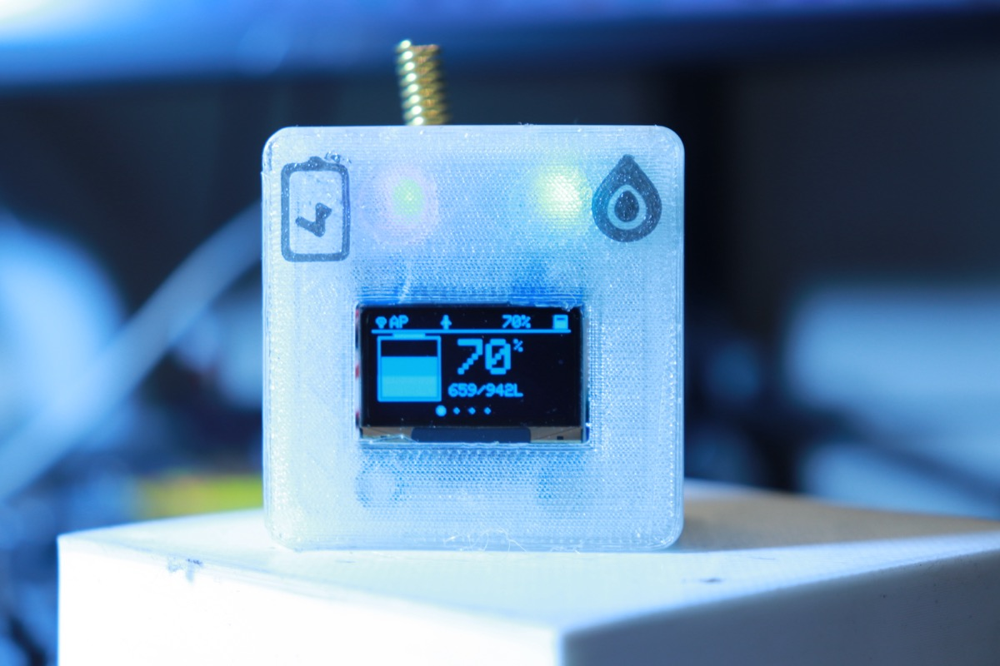
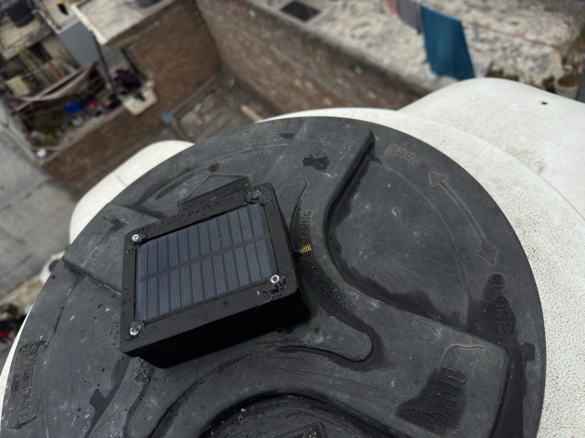
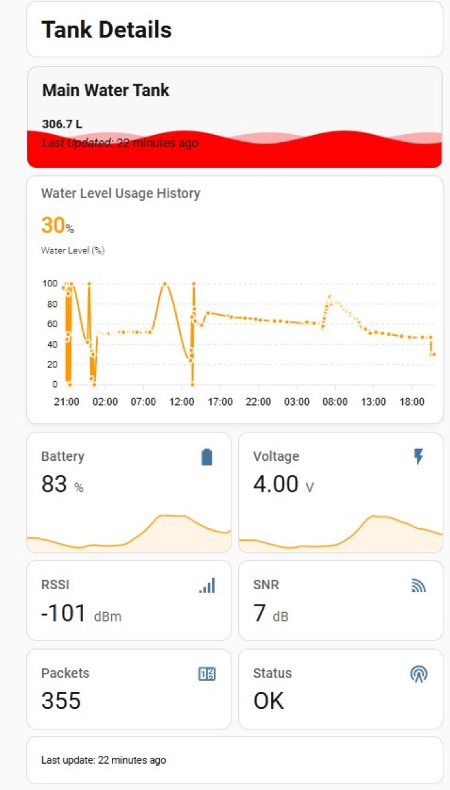

# TankSync - LoRa Water Tank Monitor

[](LICENSE)
[](pwa/LICENSE)
[](https://docs.espressif.com/projects/esp-idf/)
[](https://github.com/Techposts/LoRa-Water-Tank-Monitor/releases)
[](https://github.com/Techposts/LoRa-Water-Tank-Monitor/stargazers)

Long-range wireless water tank level monitoring using LoRa (RYLR998), ESP32, and an optional cloud dashboard. Monitor multiple tanks from up to 5km away with no WiFi needed between sensor and receiver.

<p align="center">
  
  
</p>

## Architecture

```
                    LoRa 865/915 MHz (up to 5km)
                    =========================>
  TRANSMITTER                                          RECEIVER
  ESP32-C3 SuperMini                                   ESP32 DevKit v1
  + SR04T Ultrasonic                                   + RYLR998 LoRa
  + RYLR998 LoRa                                      + SH1106 1.3" OLED
  + 18650 Battery                                      + WS2812B LED
  + Solar (optional)                                   + WiFi
                                                          |
                                              +-----------+-----------+
                                              |                       |
                                         MQTT/WiFi              Web UI
                                              |              192.168.x.x
                                    +---------+---------+
                                    |                   |
                              Home Assistant      TankSync Cloud
                              (auto-discovery)    (web dashboard)
```

## Features

- **Long Range**: RYLR998 LoRa module, 5km+ line of sight
- **Multi-Tank**: Support up to 10 transmitters per receiver
- **Low Power**: Transmitter deep sleeps between readings (configurable 1-1440 min)
- **Local Display**: SH1106 1.3" OLED on receiver shows tank levels, battery, signal
- **Web UI**: Built-in configuration interface on the receiver (WiFi, MQTT, LoRa, OTA)
- **Home Assistant**: Native MQTT auto-discovery integration
- **TankSync Cloud**: Web dashboard with push notifications, multi-site monitoring, QR device linking
- **OTA Updates**: WiFi OTA for receiver, LoRa OTA relay for transmitter
- **Captive Portal**: Auto-redirect WiFi setup on iOS, Android, and Windows
- **Remote Config**: Push sleep interval and sample count to transmitters over LoRa

## Hardware

| Component | Part | Approx. Cost |
|-----------|------|-------------|
| Receiver MCU | ESP32 DevKit v1 (or ESP32-C3 SuperMini) | $4-8 |
| Transmitter MCU | ESP32-C3 SuperMini | $3 |
| LoRa Module | REYAX RYLR998 (x2) | $8 each |
| Ultrasonic Sensor | JSN-SR04T (waterproof) | $4 |
| Display | SH1106 1.3" OLED I2C | $3 |
| Battery | 18650 LiPo + TP4056 charger | $3 |

**Total: ~$35-40 per setup**

Full bill of materials: [hardware/BOM.csv](hardware/BOM.csv)

## Quick Start

### Option 1: Pre-built Firmware (Recommended)

Download the latest `.bin` files from [Releases](https://github.com/Techposts/LoRa-Water-Tank-Monitor/releases).

```bash
# Receiver (ESP32 DevKit)
esptool.py --chip esp32 -b 460800 write_flash 0x10000 tanksync-receiver-v2.1.0.bin

# Receiver (ESP32-C3 SuperMini)
esptool.py --chip esp32c3 -b 460800 write_flash 0x10000 tanksync-receiver-c3-v2.1.0.bin

# Transmitter (ESP32-C3)
esptool.py --chip esp32c3 -b 460800 write_flash 0x10000 tanksync-transmitter-v2.1.0.bin
```

### Option 2: Build from Source

**Prerequisites:** [ESP-IDF v5.4+](https://docs.espressif.com/projects/esp-idf/en/latest/esp32/get-started/)

```bash
# Receiver (ESP32 DevKit)
cd firmware/receiver
idf.py build
idf.py -p /dev/ttyUSB0 flash

# Receiver (ESP32-C3)
cd firmware/receiver-c3
idf.py set-target esp32c3
idf.py build
idf.py -p /dev/ttyACM0 flash

# Transmitter (ESP32-C3)
cd firmware/transmitter
idf.py set-target esp32c3
idf.py build
idf.py -p /dev/ttyACM0 flash
```

### First Boot

1. **Receiver** starts in AP mode -- connect to the `TankSync` WiFi network
2. A captive portal opens automatically (or navigate to `192.168.4.1`)
3. Configure your home WiFi credentials, MQTT broker, and LoRa settings
4. **Transmitter** auto-pairs on first boot -- press the "Start Pairing" button in the receiver web UI

## TankSync Cloud

A web dashboard for monitoring your tanks from anywhere. Use the hosted version or self-host your own.

**Hosted:** [tanksync.smartghar.org](https://tanksync.smartghar.org) -- scan the QR code from your receiver's web UI to link your device.

**Self-host:**
```bash
cd pwa
npm install
cp .env.example .env    # Edit with your MQTT broker details
npm run build
npm start               # Runs on http://localhost:4800
```

Features: multi-site management, push notifications, QR code device linking, dark/light themes, historical charts.

See [pwa/deploy/](pwa/deploy/) for production deployment with systemd and Nginx.

## Home Assistant Integration

The receiver publishes auto-discovery messages via MQTT. Tanks appear automatically in Home Assistant as sensor entities.

<p align="center">
  
</p>

## Project Structure

```
firmware/
  receiver/          ESP32 DevKit receiver (MIT)
  receiver-c3/       ESP32-C3 receiver variant (MIT)
  transmitter/       ESP32-C3 transmitter (MIT)
pwa/                 TankSync Cloud dashboard (AGPL-3.0)
  server/            Fastify + SQLite + MQTT bridge
  client/            React + Tailwind frontend
hardware/            BOM and hardware designs (CC BY-SA 4.0)
docs/                Documentation and images
```

## LoRa Message Protocol

```
Transmitter -> Receiver:  TANK:<dist_cm>:<bat_pct>:<bat_v>:<msg_id>:<fw_ver>
Receiver -> Transmitter:  ACK:<msg_id>
Config Downlink:          SET:SLEEP=<seconds>:SAMP=<count>
Pairing:                  PAIR_REQ / PAIR_ACK:<addr>:<name>
```

## License

| Component | License | Details |
|-----------|---------|---------|
| Firmware (`firmware/`) | [MIT](LICENSE) | Free for any use |
| Web App (`pwa/`) | [AGPL-3.0](pwa/LICENSE) | Must share source if hosted as a service |
| Hardware (`hardware/`) | [CC BY-SA 4.0](hardware/LICENSE) | Attribution + ShareAlike |

## Contributing

Contributions are welcome! Please open an issue or pull request.

1. Fork the repository
2. Create your feature branch (`git checkout -b feature/amazing-feature`)
3. Commit your changes
4. Push to the branch
5. Open a Pull Request

## Author

**Ravi Singh** - [Techposts](https://youtube.com/@techposts)

Built with ESP-IDF, React, Fastify, and a lot of late nights.
