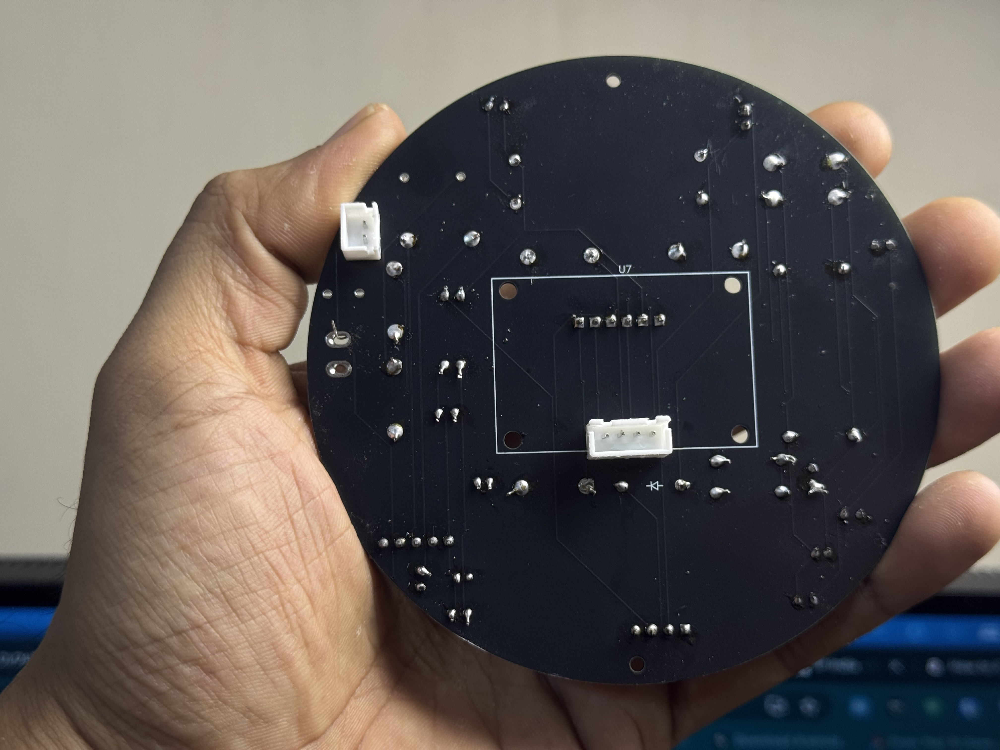
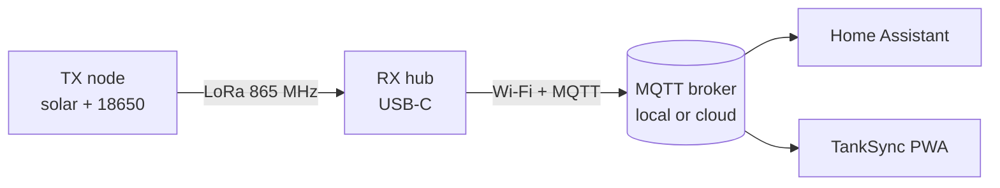

# TankSync Hardware

> Open hardware reference for the **TankSync** LoRa water-tank monitor.
> All files in this `hardware/` tree are released under **CC-BY-SA 4.0** — you can build, modify, and resell them; derivative designs must stay open under the same license.
> Firmware is **AGPL-3.0** (see `firmware/`).

TankSync is two boards talking to each other:

| Board | Role | Power | Where it lives |
|---|---|---|---|
| **TX (Transmitter)** | Ultrasonic level sensor + LoRa uplink, one per tank | Solar + 18650 Li-ion | On / inside the tank lid |
| **RX (Receiver / Hub)** | LoRa gateway + Wi-Fi / MQTT bridge + OLED + LED strip | USB-C 5 V | Indoors, plugged into a wall adapter |

A single RX hub talks to up to **6 TX nodes** over 865 / 868 / 915 MHz LoRa (region-selectable in firmware). The RX publishes readings to a local MQTT broker or to the SmartGhar cloud — your choice.

---

## What's in this folder

| Path | What | Format |
|---|---|---|
| [`BOM.csv`](BOM.csv) | Complete bill of materials for both boards + the enclosure | CSV |
| [`pcb/`](pcb/) | Schematics (PNG + SVG), pin assignments, 3D STEP files, system block diagram | PNG / SVG / PDF / STEP |
| [`cases/circular-v1/`](cases/circular-v1/) | **Current** production case — circular PETG, integrated solar lid, BSP-threaded sensor mount | STL |
| [`cases/rectangular-v10/`](cases/rectangular-v10/) | **Legacy** v1.0 case — rectangular, older PCB form factor (kept for reference) | STL |
| [`photos/`](photos/) | Photos of the assembled PCB and finished case (9 images, see below) | JPG |

### Gallery (TX build)

| | |
|---|---|
|  |  |
| Bare PCB, top side | Hand-soldered, top side |
|  |  |
| Bottom side (passives + Schottky) | Angled view, modules stacked |
|  |  |
| Lid with integrated solar pocket | Closed assembly side view |
|  |  |
| BSP boss in test tank lid | Close-up of nut + thread |
|  | |
| Opened unit, SMA antenna variant | |

Each subfolder has its own `README.md` explaining what's inside and how to use it.

---

## Bird's-eye system diagram

All modules share a common ground. One TX per tank; one RX hub per property; up to 6 tanks per hub. Broker is either your local Mosquitto, or `mqtt.smartghar.org` if you use the free cloud tier.

---

## Quick start — I just want to build one

1. Print the case files from [`cases/circular-v1/`](cases/circular-v1/) (PETG, 0.2 mm, 30 % infill — see that folder's README).
2. Order parts from [`BOM.csv`](BOM.csv).
3. Get the PCBs fabbed from `pcb/rx-schematic.*` + `pcb/tx-schematic.*` (or send the project files to JLCPCB / PCBWay).
4. Solder, populate the BOM, then flash the firmware → easiest path is the **browser flasher** at [tanksync.smartghar.org/firmware](https://tanksync.smartghar.org/firmware) (Chrome / Edge desktop, USB-C cable, no toolchain install).
5. Power on the RX → connect to its `TankSync-Setup-XXXX` Wi-Fi AP → configure Wi-Fi + MQTT.
6. Hold the TX boot button 5 s → it joins the RX automatically via LoRa pairing mode.

The TankSync wiki has a step-by-step build guide: [github.com/Techposts/TankSync/wiki](https://github.com/Techposts/TankSync/wiki).

---

## Licensing

- **Firmware** (anything under `firmware/`) — AGPL-3.0
- **Hardware** (schematics, PCB layouts, STL cases, BOM, this folder) — CC-BY-SA 4.0
- **Brand** — "TankSync" and "SmartGhar" are trademarks of Ravi Singh / TechPosts Media; you can build and sell the open-hardware design but please don't use the brand names for commercial derivatives.

Patches welcome via pull request. If you ship a commercial product based on this design, the AGPL + CC-BY-SA terms require you to publish your modifications under the same license.
