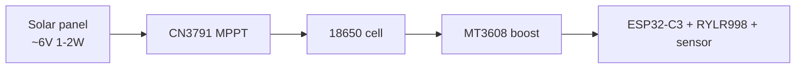
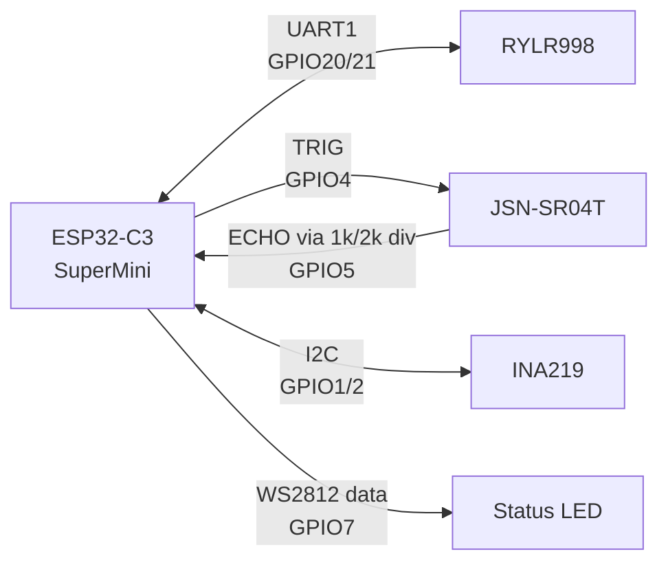
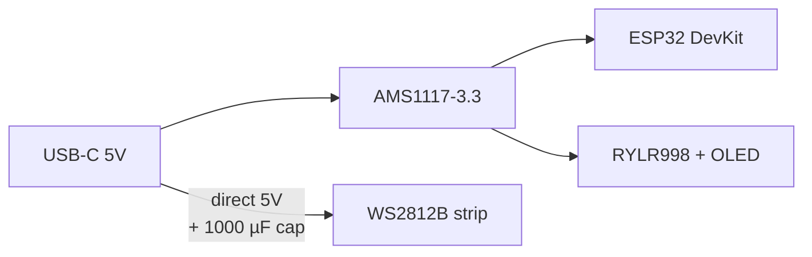
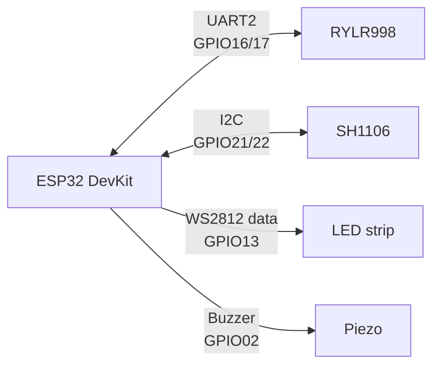

# TankSync PCB Designs

Both boards were designed by **Ravi Singh** in EasyEDA — solo design work, no hardware team. The current production revision (**REV 2.2**, May 2026) has been **bench-tested at 45 °C ambient through Delhi summer** with no observable RYLR998 RSSI drift or boost-converter sag.

The TX is a **custom circular PCB** sized to drop straight into the [circular-v1 enclosure](../cases/circular-v1/). The RX is a **rectangular carrier** that sockets an ESP32 DevKit v1 (CP2102) module — no microcontroller redesign needed.

---

## Files in this folder

| File | What it is | When you need it |
|---|---|---|
| [`rx-schematic.png`](rx-schematic.png) / [`.svg`](rx-schematic.svg) | RX hub schematic | Read before populating the board |
| [`tx-schematic.png`](tx-schematic.png) / [`.svg`](tx-schematic.svg) | TX transmitter schematic | Read before populating the board |
| [`pin-assignments.md`](pin-assignments.md) / [`.pdf`](pin-assignments.pdf) | GPIO → function table for both boards | When firmware doesn't see a peripheral — check here first |
| [`system-block-diagram.pdf`](system-block-diagram.pdf) | One-page TX↔RX↔cloud overview | When explaining the system to someone new |
| [`rx-pcb-3d.step`](rx-pcb-3d.step) / [`tx-pcb-3d.step`](tx-pcb-3d.step) | 3D CAD models of the populated boards | If you're designing your own enclosure — import into Fusion / FreeCAD / OnShape |
| [`project-requirements.txt`](project-requirements.txt) | The original brief sent to PCBWay | Reference only — supersedes by the schematics + pin-assignments above |

---

## TX board (transmitter) — at a glance

- **MCU**: ESP32-C3 SuperMini (RISC-V, Wi-Fi + BLE, PCB antenna)
- **Radio**: REYAX RYLR998 LoRa module (UART AT-command, 865 / 868 / 915 MHz selectable)
- **Sensor**: JSN-SR04T / AJ-SR04M waterproof ultrasonic — connected via screw terminals so the sensor cable is field-installable
- **Power**: 18650 Li-ion + CN3791 MPPT solar charger + MT3608 3.3 V boost
- **Battery telemetry**: INA219 over I²C (current + voltage, signed) — replaced the older voltage-divider design in v1.0
- **Protection**: inline Schottky on the 18650 (+) rail; 1 k + 2 k divider on the 5 V ECHO line so the ECHO signal is safe for the C3's 3.3 V GPIO

### Power path

All modules share a common ground. Vmpp tracking lands the panel near 4.5 V. The CN3791's BAT+ feeds the 18650 holder through an inline Schottky (SS14 / 1N5819) — destroyed two test boards before adding this.

### Signal path

The full pin map is in [`pin-assignments.md`](pin-assignments.md) — that's the source of truth; if this diagram drifts, the table wins. Wire-by-wire detail also lives there.

---

## RX board (hub) — at a glance

- **MCU**: ESP32 DevKit v1 (Tensilica, Wi-Fi + BLE, USB-C onboard via CP2102)
- **Radio**: RYLR998 (same module as TX, same frequency, addresses differ)
- **Display**: 1.3" SH1106 OLED over I²C (status + Wi-Fi + IP + paired tanks)
- **LED strip**: WS2812B — user-selectable 2 / 8 / 24 LEDs, configured via the local web UI
- **Buzzer** (since rx-v2.8.0): active 3-pin piezo on GPIO 02 — audible nudges for low water, overflow, sensor errors
- **Power**: USB-C 5 V, 1 A nominal (5 W adapter is fine)

### Power path (RX)

The WS2812B strip is on the **raw 5 V rail**, not the 3.3 V regulator output — a 24-LED ring at full white can draw >1 A, which would brown out the LDO. The 1000 µF inrush cap is critical.

### Signal path (RX)

`GPIO 2` on the DevKit is taken by the **on-board LED**, which is why the **WS2812 data line is on GPIO 13**, not GPIO 2 — don't move it.

---

## Schematic reading tips (from review)

- The schematic PNG renders are correct but small; if you're hand-reviewing, open the SVG in a browser and zoom — the layer naming is preserved.
- The ECHO divider (TX) is on the PCB; do not omit it even if your sensor is rated for 3.3 V. JSN-SR04T variants in the wild differ on ECHO logic level, and the divider is cheap insurance.
- The I²C pull-ups on the TX board are populated as 4.7 kΩ. Some INA219 breakouts ship with their own pull-ups — if you use a breakout, remove or de-populate the on-PCB ones to avoid double pull-up.
- All decoupling caps (100 nF) belong **within 5 mm** of the IC power pin. The schematic shows them grouped for readability, but the layout enforces the distance.

---

## Critical things the firmware will refuse to boot without

1. **TX**: RYLR998 must answer `AT\r\n` at 115200 baud within 1.5 s. If wiring is reversed (TX↔RX swap), nothing pairs.
2. **RX**: SH1106 OLED must respond at I²C 0x3C. If absent or at 0x3D, the display stays blank but firmware otherwise runs — useful as a diagnostic.
3. **TX**: INA219 should answer at I²C 0x40. If absent, firmware falls back to voltage-divider battery monitoring on GPIO 0 (Variant A).

If you're hitting a boot loop, scope the UART RX line on either board first — most "the radio is dead" reports are reversed TX/RX wiring.
