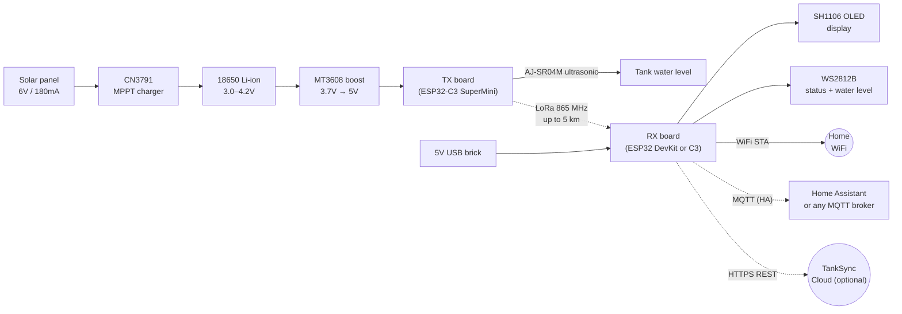
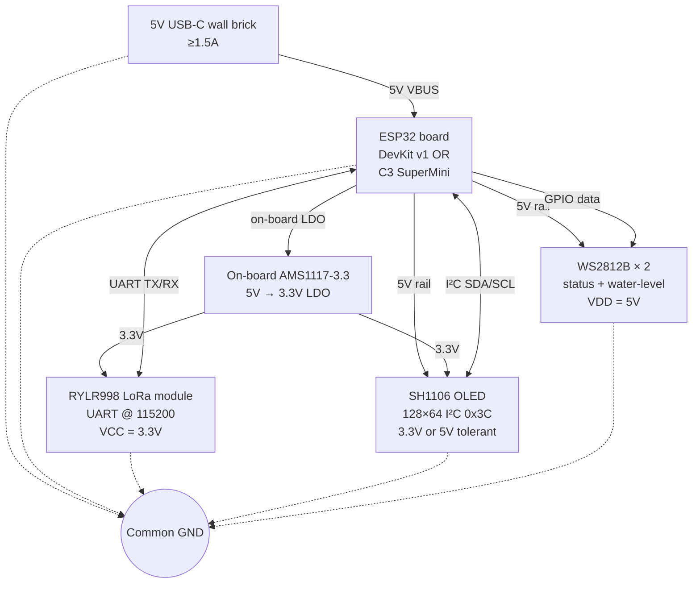
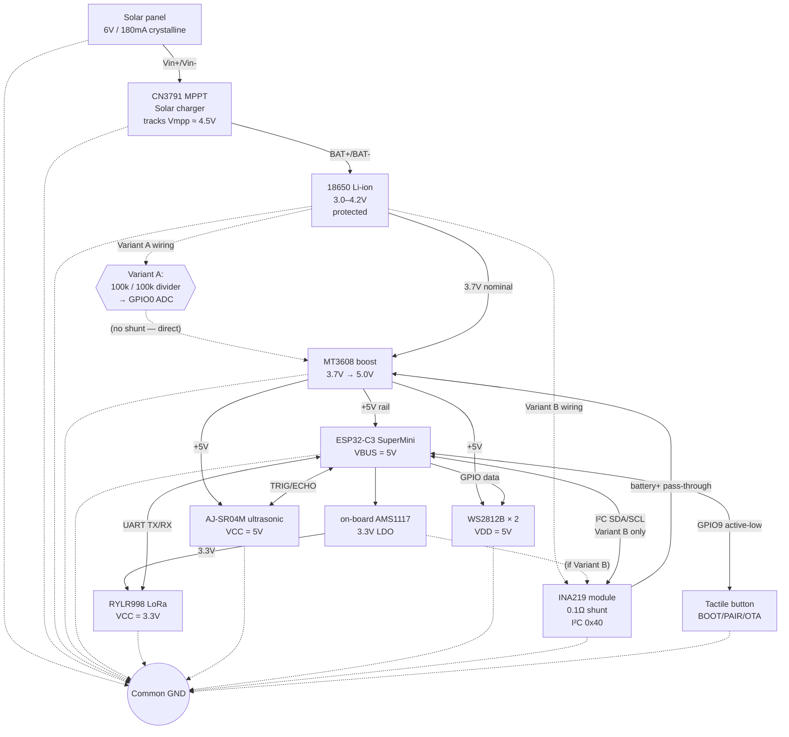

# TankSync Hardware Wiring & Pin Connections

Authoritative wiring reference for the TankSync receiver (RX) and transmitter (TX) boards. Pin assignments here match `firmware/<target>/main/config.h` exactly; if the two ever disagree, the `config.h` file is the source of truth and this doc must be updated.

## Topology overview

| Device | Power source | Where it lives | Duty cycle |
|---|---|---|---|
| **RX** (receiver / display unit) | 5V USB-C wall brick (≥1.5A) → on-board 3.3V LDO | Indoors, near a power outlet, within WiFi range | Always-on; WiFi STA + LoRa RX listening continuously |
| **TX** (transmitter / sensor unit) | 6V solar panel → CN3791 MPPT charger → 18650 Li-ion → MT3608 boost → 5V rail | Outdoors, mounted on or near the water tank, often far from the house | Deep-sleep cycle: wakes every 5 min, samples ultrasonic + LoRa burst (~3s awake), sleeps |

The TX is the energy-constrained device. The RX is intentionally indoor-and-plugged so its power budget (display + WiFi + LoRa-listen + LEDs) doesn't have to fit a small solar harvest.

### Whole-system flow



---

## Receiver (RX) wiring

There are **two RX hardware variants** depending on the ESP32 chip on hand:
- **DevKit ESP32 v1** (CP2102, 30-pin header) — full-size, more GPIOs, easier to breadboard
- **ESP32-C3 SuperMini** — pocket-sized, fewer GPIOs

Both variants use the **same external modules** (RYLR998 LoRa, SH1106 OLED, WS2812B LEDs). Only the GPIO assignments differ. Power comes from a 5V USB-C wall brick into the dev-board's USB connector; the on-board AMS1117-3.3 LDO derives the 3.3V rail used by RYLR998.

### RX circuit diagram



### RX block diagram (alt-text view)

```
 [5V USB-C wall brick, ≥1.5A]
            │
            ▼
   ┌──────────────────────┐
   │  ESP32 (DevKit / C3) │
   │  USB connector       │
   └─┬──────────────────┬─┘
     │ 5V rail          │ 3.3V rail (from on-board LDO)
     ▼                  ▼
 ┌────────────┐    ┌────────────┐    ┌──────────────────┐
 │ WS2812B ×2 │    │ RYLR998    │    │ SH1106 OLED      │
 │ (status +  │    │ LoRa       │    │ 128×64, I²C 0x3C │
 │  water lvl)│    │ UART @     │    │ 3.3V or 5V       │
 │ VDD = 5V   │    │ 115200     │    │ tolerant module  │
 │ DIN = GPIO │    │ VCC = 3.3V │    │ SDA, SCL pins    │
 └────────────┘    └────────────┘    └──────────────────┘
```

### Pin map — DevKit ESP32 RX

Source: `firmware/receiver/main/config.h`

| GPIO | Function | Connects to | Notes |
|---|---|---|---|
| 13 | WS2812B data | DIN of first LED in 2-LED chain | 3.3V data may need 74AHCT125 buffer if flicker observed |
| 16 | UART2 RX | RYLR998 TXD | DevKit has UART2 free; C3 doesn't |
| 17 | UART2 TX | RYLR998 RXD | |
| 21 | I²C SDA | SH1106 SDA | Standard I²C bus |
| 22 | I²C SCL | SH1106 SCL | |
| 5V | Power | WS2812B VDD, OLED VCC (5V variant) | From USB |
| 3.3V | Power | RYLR998 VCC, OLED VCC (3.3V variant) | From on-board LDO |
| GND | Ground | All modules | Single common ground |

#### Wire-by-wire — DevKit ESP32 RX

Every wire you actually solder/breadboard, in order:

```
ESP32 DevKit GPIO13       →  WS2812B #1 DIN
ESP32 DevKit 5V (VIN/USB) →  WS2812B #1 VDD
ESP32 DevKit GND          →  WS2812B #1 GND
WS2812B #1 DOUT           →  WS2812B #2 DIN  (chain)
WS2812B #1 VDD            →  WS2812B #2 VDD
WS2812B #1 GND            →  WS2812B #2 GND

ESP32 DevKit GPIO16 (RX2) →  RYLR998 TXD
ESP32 DevKit GPIO17 (TX2) →  RYLR998 RXD
ESP32 DevKit 3.3V         →  RYLR998 VCC
ESP32 DevKit GND          →  RYLR998 GND
                             RYLR998 RST  (leave floating, or pull-up to 3.3V)

ESP32 DevKit GPIO21       →  SH1106 OLED SDA
ESP32 DevKit GPIO22       →  SH1106 OLED SCL
ESP32 DevKit 3.3V or 5V   →  SH1106 OLED VCC  (most modules accept either)
ESP32 DevKit GND          →  SH1106 OLED GND
```

### Pin map — ESP32-C3 SuperMini RX

Source: `firmware/receiver-c3/main/config.h`

| GPIO | Function | Connects to | Notes |
|---|---|---|---|
| 2 | WS2812B data | DIN of first LED in chain | |
| 9 | I²C SDA | SH1106 SDA | C3 GPIO matrix routes I²C anywhere |
| 10 | I²C SCL | SH1106 SCL | |
| 20 | UART1 RX | RYLR998 TXD | C3 only has UART0 (USB) and UART1 |
| 21 | UART1 TX | RYLR998 RXD | |
| 5V | Power | WS2812B VDD, OLED VCC (5V variant) | From USB |
| 3.3V | Power | RYLR998 VCC, OLED VCC (3.3V variant) | From on-board LDO |
| GND | Ground | All modules | Single common ground |

#### Wire-by-wire — ESP32-C3 SuperMini RX

```
C3 SuperMini GPIO2        →  WS2812B #1 DIN
C3 SuperMini 5V           →  WS2812B #1 VDD
C3 SuperMini GND          →  WS2812B #1 GND
WS2812B #1 DOUT           →  WS2812B #2 DIN  (chain)
WS2812B #1 VDD            →  WS2812B #2 VDD
WS2812B #1 GND            →  WS2812B #2 GND

C3 SuperMini GPIO20 (RX1) →  RYLR998 TXD
C3 SuperMini GPIO21 (TX1) →  RYLR998 RXD
C3 SuperMini 3.3V         →  RYLR998 VCC
C3 SuperMini GND          →  RYLR998 GND

C3 SuperMini GPIO9        →  SH1106 OLED SDA
C3 SuperMini GPIO10       →  SH1106 OLED SCL
C3 SuperMini 3.3V or 5V   →  SH1106 OLED VCC
C3 SuperMini GND          →  SH1106 OLED GND
```

---

## Transmitter (TX) wiring — solar-powered, two power-monitoring variants

The TX is `firmware/transmitter/` (ESP32-C3 SuperMini). The board ships in two variants depending on the level of power-monitoring telemetry desired:

- **Variant A — Voltage divider only** (basic): battery percentage from ADC reading. Cheapest BOM. Used in the entry-level product SKU.
- **Variant B — INA219 over I²C** (full): bidirectional current, accurate bus voltage, and computed power. Used in the premium SKU and required for any cloud-side energy analytics.

The firmware **auto-detects** which variant is installed by I²C-scanning at INA219's default address (`0x40`) at boot. Users can also force a mode via the web UI dropdown (Auto / Force INA219 / Force voltage divider / Disabled). The mode is saved to NVS.

### TX circuit diagram



### TX power chain (alt-text view)

```
   ┌──────────────────────┐
   │  Solar panel         │   6V open-circuit, 180mA short-circuit
   │  (6V / 180mA / ~1W)  │   (Robu / generic crystalline)
   └──────────┬───────────┘
              │ Vin
              ▼
   ┌──────────────────────┐
   │  CN3791              │   MPPT, tracks Vmpp ~4.5V on this panel
   │  MPPT Solar Charger  │   ~85% efficiency under MPPT
   │  (Robu listing)      │   R_PROG sets charge current (default ~500mA)
   └──────────┬───────────┘
              │ BAT± to cell
              ▼
   ┌──────────────────────┐
   │  18650 Li-ion        │   3000 mAh, with PCB protection circuit
   │  (3.0–4.2V)          │   (mandatory — CN3791 has no over-discharge protection)
   └──────────┬───────────┘
              │
              ├─► [Variant A: voltage divider 100k/100k → GPIO0 (ADC1_CH0)]
              │
              ├─► [Variant B: INA219 in series with battery+ → I²C to ESP32]
              │
              ▼
   ┌──────────────────────┐
   │  MT3608 Boost        │   3.7V → 5V regulated output
   │  3.7V → 5V           │   ~85% efficiency
   │  EN tied high (or to GPIO10 for low-power deep-sleep gating)
   └──────────┬───────────┘
              │ +5V rail
              ▼
   ┌──────────┴────────────────────────────────────────────┐
   ▼                  ▼              ▼              ▼
 ┌────────────┐  ┌──────────┐  ┌──────────┐  ┌──────────┐
 │ ESP32-C3   │  │ WS2812B  │  │ AJ-SR04M │  │ Common   │
 │ SuperMini  │  │ ×2       │  │ Sonar    │  │ GND      │
 │ VBUS = 5V  │  │ VDD = 5V │  │ VCC = 5V │  │          │
 └─────┬──────┘  │ DIN = G7 │  │ TRIG = G4│  └──────────┘
       │        └──────────┘  │ ECHO = G5│
       │                      └──────────┘
       │ on-board AMS1117-3.3 LDO
       ▼
   3.3V rail → RYLR998 LoRa (VCC, RXD = GPIO21, TXD = GPIO20)
```

### TX pin map — Variant A (voltage divider only)

Source: `firmware/transmitter/main/config.h` (BAT_ADC_CHANNEL = 0)

| GPIO | Function | Connects to |
|---|---|---|
| 0 | ADC1_CH0 — battery voltage | Junction of 100kΩ / 100kΩ divider on Vbat (battery+ → 100k → GPIO0 → 100k → GND) |
| 4 | Ultrasonic TRIG | AJ-SR04M TRIG |
| 5 | Ultrasonic ECHO | AJ-SR04M ECHO |
| 7 | WS2812B data | DIN of first WS2812B (2 LEDs in series) |
| 8 | On-board LED | Built-in (no external) |
| 9 | Button | Tactile switch to GND, internal pull-up |
| 20 | UART1 RX | RYLR998 TXD |
| 21 | UART1 TX | RYLR998 RXD |
| 1, 2, 3, 6, 10 | **FREE** | Reserved for future expansion |

#### Wire-by-wire — TX Variant A

Power chain wires:

```
Solar panel (+)            →  CN3791 IN+
Solar panel (–)            →  CN3791 IN–
CN3791 BAT+                →  18650 cell positive (via protection PCB)
CN3791 BAT–                →  18650 cell negative (via protection PCB)

18650 BAT+ (post-protect)  →  Junction A — splits to 3 places:
                              (1) 100kΩ resistor → GPIO0 → 100kΩ → GND  (divider)
                              (2) MT3608 boost VIN+
18650 BAT– (post-protect)  →  Common GND  (also MT3608 GND, panel GND)

MT3608 VOUT+               →  +5V rail — splits to:
                              (1) C3 SuperMini 5V (VBUS)
                              (2) WS2812B #1 VDD
                              (3) AJ-SR04M VCC
MT3608 VOUT–               →  Common GND
MT3608 EN (optional)       →  C3 SuperMini GPIO10 (recommended for sleep gating)
```

Signal/sensor wires:

```
C3 SuperMini GPIO0         →  Voltage-divider midpoint (described above)
C3 SuperMini GPIO4         →  AJ-SR04M TRIG
C3 SuperMini GPIO5         →  AJ-SR04M ECHO
C3 SuperMini GPIO7         →  WS2812B #1 DIN
WS2812B #1 DOUT            →  WS2812B #2 DIN  (chain)
C3 SuperMini GPIO9         →  Tactile button → GND  (uses internal pull-up)
C3 SuperMini GPIO20 (RX1)  →  RYLR998 TXD
C3 SuperMini GPIO21 (TX1)  →  RYLR998 RXD
C3 SuperMini 3.3V (output) →  RYLR998 VCC
C3 SuperMini GND           →  Common GND  (and all module GNDs)
```

### TX pin map — Variant B (INA219 over I²C)

Adds I²C bus on GPIO1/2; voltage divider is **not installed** (INA219's bus-voltage register replaces it).

| GPIO | Function | Connects to |
|---|---|---|
| 0 | (unused — divider not installed in this variant) | — |
| 1 | I²C SDA | INA219 SDA (with 4.7kΩ pull-up to 3.3V) |
| 2 | I²C SCL | INA219 SCL (with 4.7kΩ pull-up to 3.3V) |
| 4 | Ultrasonic TRIG | AJ-SR04M TRIG |
| 5 | Ultrasonic ECHO | AJ-SR04M ECHO |
| 7 | WS2812B data | WS2812B DIN |
| 8 | On-board LED | Built-in |
| 9 | Button | Tactile switch |
| 20 | UART1 RX | RYLR998 TXD |
| 21 | UART1 TX | RYLR998 RXD |
| 3, 6, 10 | **FREE** | Reserved |

#### Wire-by-wire — TX Variant B

Power chain (note INA219 inserted in series with battery+):

```
Solar panel (+)            →  CN3791 IN+
Solar panel (–)            →  CN3791 IN–
CN3791 BAT+                →  Junction X (see below)
CN3791 BAT–                →  Common GND

18650 BAT+ (post-protect)  →  INA219 V+ (battery side of shunt)
INA219 V–                  →  Junction X
Junction X                 →  CN3791 BAT+  AND  MT3608 VIN+
18650 BAT– (post-protect)  →  Common GND

MT3608 VOUT+               →  +5V rail — splits to:
                              (1) C3 SuperMini 5V (VBUS)
                              (2) WS2812B #1 VDD
                              (3) AJ-SR04M VCC
MT3608 VOUT–               →  Common GND
MT3608 EN (optional)       →  C3 SuperMini GPIO10 (recommended for sleep gating)
```

INA219 control wires:

```
C3 SuperMini GPIO1         →  INA219 SDA  (4.7kΩ pull-up to 3.3V — most modules include this)
C3 SuperMini GPIO2         →  INA219 SCL  (4.7kΩ pull-up to 3.3V — same)
C3 SuperMini 3.3V (output) →  INA219 VS  (powers the IC; ≠ load voltage)
C3 SuperMini GND           →  INA219 GND
```

Notes on INA219 wiring:
- **V+ goes to the battery side of the shunt**, V– goes to the common-node side. The chip's bus-voltage register reads V– (= load voltage = battery voltage minus tiny shunt drop). The shunt-voltage register is signed: positive when current flows from V+ to V– (discharging), negative when reversed (charging).
- Address jumpers A0/A1 left **open** → I²C address `0x40` (default, what firmware probes).
- Module is wired in series with **battery+** (high-side sensing). Don't accidentally place it between the panel and the charger — it must see both charge and discharge currents in opposite directions.

Signal/sensor wires (identical to Variant A — same firmware binary):

```
C3 SuperMini GPIO4         →  AJ-SR04M TRIG
C3 SuperMini GPIO5         →  AJ-SR04M ECHO
C3 SuperMini GPIO7         →  WS2812B #1 DIN
WS2812B #1 DOUT            →  WS2812B #2 DIN  (chain)
C3 SuperMini GPIO9         →  Tactile button → GND
C3 SuperMini GPIO20 (RX1)  →  RYLR998 TXD
C3 SuperMini GPIO21 (TX1)  →  RYLR998 RXD
C3 SuperMini 3.3V (output) →  RYLR998 VCC
C3 SuperMini GND           →  Common GND
```

### INA219 wiring detail (Variant B)

The INA219 is wired with its shunt resistor **in series with the battery's positive terminal**, so a single shunt sees both charge and discharge currents. INA219's signed shunt-voltage register distinguishes the direction automatically.

```
  [Battery+] ──[INA219 SHUNT (R_SH)]── [Common+ node] ─┬─ CN3791 BAT pin
                  │  │                                  └─ MT3608 boost input
                 V+  V-
                  ▲   ▲
                  │   │
       INA219 V+ pin connects to battery side of shunt
       INA219 V- pin connects to common-node side of shunt

  INA219 SDA  → ESP32-C3 GPIO1
  INA219 SCL  → ESP32-C3 GPIO2
  INA219 VS   → ESP32-C3 3.3V output pin (powers the IC; ≠ load voltage)
  INA219 GND  → common ground
  INA219 ADDR → 0x40 (default; A0/A1 jumpers left open)
```

**Sign convention** (firmware-level interpretation):
- Positive shunt current → battery is **discharging** (current leaving battery toward boost converter)
- Negative shunt current → battery is **charging** (current flowing from CN3791 into battery)

Bus voltage register reads the V- side relative to GND, which is the battery voltage (post-shunt; the shunt drop is millivolts and negligible for SoC display).

### Sensor auto-detect & manual override

Firmware behavior at boot:

1. Initialize I²C bus on GPIO1 (SDA) / GPIO2 (SCL) at 100 kHz
2. Probe address `0x40` with a single read
3. If ACK → `power_mode = "ina219"`, save to NVS (overwrites manual setting only if `manual_override = "auto"`)
4. If NACK → `power_mode = "voltage"`, fall back to ADC on GPIO0 with the existing `battery_monitor` divider logic
5. NVS-stored `power_mode_override` field can force any mode: `"auto"`, `"ina219"`, `"voltage"`, `"disabled"`

Web UI exposes the override under TX Settings → Power Monitoring with a `<select>` dropdown showing the auto-detected value. PWA reads `/api/system → power_mode` and conditionally renders basic vs rich power telemetry.

---

## Bill of Materials (BOM additions)

For the canonical full BOM see `BOM.csv` in this directory. New entries added 2026-04-27 to support the solar-TX power chain:

| Component | Variant | Approx ₹ (Robu / generic) | Notes |
|---|---|---|---|
| Solar panel 6V / 180mA crystalline | A & B | ~150 | Polycrystalline, ~250×80 mm |
| CN3791 MPPT solar charger module | A & B | ~120 | Buck-MPPT with R_PROG charge-current setting |
| 18650 Li-ion 3000 mAh + protected holder | A & B | ~200 | Protection circuit mandatory (CN3791 lacks over-discharge cutoff) |
| MT3608 DC-DC boost module 3.7V→5V | A & B | ~50 | EN pin recommended to GPIO10 for deep-sleep gating |
| 100 kΩ resistor ×2 (voltage divider) | A only | ~5 | 1% tolerance recommended for accurate SoC |
| INA219 module (Adafruit-style, 0.1Ω shunt) | B only | ~120 | Default I²C address 0x40 |
| 4.7 kΩ resistor ×2 (I²C pull-ups) | B only | ~5 | Most INA219 modules already include these onboard |

**Variant A total adder:** ~₹525
**Variant B total adder:** ~₹640

---

## Future expansion (reserved free GPIOs on TX)

| GPIO | Reserved for | Why |
|---|---|---|
| GPIO3 | CN3791 STAT pin (charging-LED output) | Direct read of charger state without inferring from current sign |
| GPIO6 | Future PIR / motion sensor | Wake-on-motion to extend battery on long deep-sleep |
| GPIO10 | MT3608 boost EN pin | Disable boost in deep-sleep to recover ~120 mAh/day quiescent loss |

---

## Firmware compatibility

The shared `battery_monitor` component (in both `public/firmware/transmitter/components/battery_monitor/` and `cloud/firmware/Transmitter-IDF/components/battery_monitor/`) currently provides voltage-divider support. INA219 + auto-detect support is added in **both trees** as a hardware-platform feature (not a cloud-roadmap feature) — see `project_firmware_strategy.md` rule #2 in project memory.

After the firmware update lands, the API surface becomes:

```c
// power_monitor.h (was battery_monitor.h)

typedef enum {
    POWER_MODE_NONE,
    POWER_MODE_VOLTAGE,
    POWER_MODE_INA219,
} power_mode_t;

typedef struct {
    power_mode_t mode;
    int      pct;          // 0–100 estimated SoC
    uint32_t vbat_mv;      // battery voltage
    int32_t  current_ma;   // signed; +ve = discharging, -ve = charging (INA219 only; 0 in voltage mode)
    int32_t  power_mw;     // V × I (INA219 only; 0 in voltage mode)
    bool     charging;     // explicit flag (from current sign or voltage trend)
} power_reading_t;

esp_err_t power_init(void);                      // auto-detect + NVS-stored override
esp_err_t power_read(power_reading_t *out);
esp_err_t power_set_override(const char *mode);  // "auto" | "ina219" | "voltage" | "disabled"
```

---

## License

Hardware design is open: BOM under CC BY-SA 4.0, schematics & wiring docs (this file) under MIT. Firmware in `public/firmware/` is MIT; firmware in `cloud/firmware/` is AGPL-3.0 (proprietary cloud variant).
